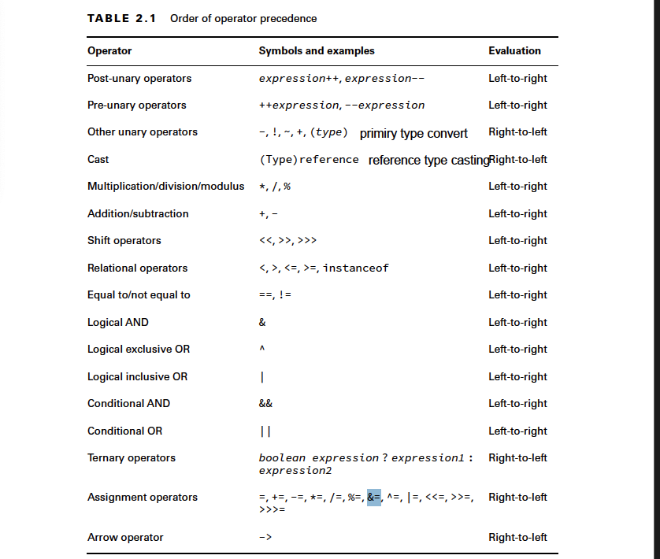

# Java Operators
## Operator and operand
- special symbol applied to variables, values, literals. These variables, values, literals are operand
- Type of operators: unary( applied to one operand), binary(applied to two operands), ternary(applied to three operands)
- operator precedence: 
1. not necessarily to be read from left-to-right
```java
int cookies = 4;
double reward = 3 + 2 * --cookies;
```
2. Unless overridden with parentheses, Java operators follow order of operation- operators at the top have higher precedence than those below.

    --> bitwise NOT operator  (~) : applied to integer types (int, long, short, char, byte) and BigInt;For integer, the bitwise NOT operator inverts each bit in this 32-bit representation. It changes every 0 to 1 and every 1 to 0.Due to this 32-bit operation, the bitwise NOT of any integer x is always equal to -(x + 1). (i.e ~5 is -6); Regardless of the declared type (byte, short, int, long, char), when performing bitwise operations, Java internally promotes these values to at least 32-bit int. This process is called integer promotion.For types smaller than int (byte, short, char), the value is first zero-extended or sign-extended to 32 bits.After the operation, the result is truncated back to the original type if necessary.This means extra bits are discarded for smaller types: 
        byte: Promoted to 32-bit int, operation performed, result truncated to 8 bits.
        short: Promoted to 32-bit int, operation performed, result truncated to 16 bits.
        char: Promoted to 32-bit int, operation performed, result truncated to 16 bits.
        int: Operation performed on full 32 bits.
        long: Operation performed on full 64 bits.  
    --> post-unary (x++/x--) vs pre-unary(++x,--x): the current value of the variable is used in the expression first(i.e y = x++ -> y =x ) then its increment or decrement (x = x +1) >< the increment or decrement is used in the expression first (y =  ++x -> y = x+1), new value is returned (x = x+1)
    **NOTE: what is shift operations??**
    - Converting binary bit to decimal: 
        1. In two's complement, the leftmost (most significant) bit is used as the sign bit: 0 indicates a positive number; 1 indicates a negative number
        2. For negative number, to convert it we go through following steps: 
            -> for example: 1111 1000 
            -> Invert all bits: 0000 0111
            -> Add 1: 0000 1000. we start from the rightmost bit, If the bit is 0, change it to 1 and stop, If the bit is 1, change it to 0 and carry 1 to the next bit (moving left)
                -> The rightmost 1 becomes 0, and we carry 1
                -> The next 1 becomes 0, and we carry 1
                -> The next 1 becomes 0, and we carry 1.
                -> The next 0 becomes 1, and we stop
                -> The result is 00001000 ( equals to 8 in decimal)
    - Left shift (<<) is equivalent to multiplying by 2^n, where n is the shift amount. It shifts bits to the left, discarding the leftmost bits.It does not preserve the sign bit.New bits are filled in on the right with 0s.As you shift left, if a 1 bit reaches the sign bit position, this is an overflow situation.
            for example: 
                int a = 5;  // Binary: 0000 0101
                int result = a << 2;  // Binary: 0001 0100
    - Signed right shift (>>):Shifts the bits to the right, preserving the sign bit (leftmost bit).For negative numbers, it fills the leftmost bits with 1s. For positive numbers: Fills the leftmost bits with 0. Right shift (>>) is equivalent to dividing by 2^n for positive numbers.
            for example:
                int a = -8;  // Binary: 1111 1000
                int result = a >> 2;  // Binary: 1111 1110  
    - Unsigned right shift(>>>):Shifts the bits to the right, always filling the leftmost bits with 0,regardless of whether the number is positive or negative.Does not preserve the sign
    - Logical exclusive (XOR) vs logical inclusive(OR)
    ```java
    boolean x = true;
    boolean y = false;

    System.out.println(x | y);  // true (Inclusive OR) - when either x or y is true
    System.out.println(x ^ y);  // true (Exclusive OR)- when x is different from y

    x = true;
    y = true;
    ```
    ```java
    // 0^0 = 0, 0^1 = 1,1^0 = 0, 1^1 = 0
    //0|0 = 0,0|1 =1,1|0 = 1,1|1 =1
    //0&0 = 0,0&1 = 0,1&0 = 0,1&1 =1
    int a = 5;  // 0101 in binary
    int b = 3;  // 0011 in binary
    int result = a ^ b;  // 0110 in binary (6 in decimal)
    int result1 = a | b // 0111 in binary (7 in decimal)
    int result2 = a&b //0001 in binary (1 indecimal)
    ```


## Numberic promotion rules
1. If an operation have two operants of different data types, one will be promoted to the larger of the two data types
2. One is integer and the other is float, java will auto promote the integral value to float
3. Smaller data types : byte, short, char are to be promoted to int in binary arithmetic operator, even if none of the operands is int
4. Resulting value will have the same data type as its promoted operands
5. Trying to convert from larger to smaller data types without casting will throw a compiler exception
6. if the value is out of range for its type before casting, it will not compile
7. When the value is too large to be stored in data type, overflow occurs. The system will wraps around to the lowest negative value and count up from there
## Casting
- Only required when converting to a smaller or narrowing data type -> Primitive type casting is about data size and potential loss of precision. byte → short → int → long → float → double
    NOTE: Using compound assignment operators will lead to safe downcasting as the compiler will auto cast the reusulting value to the data type of the value on the left side of the coumpound operator.
- Reference type casting is about the inheritance hierarchy and object types. Upcasting in reference type is to treat a child class object as an instance of its parent class. Hence, only methods declared in the parent class are accessible. At runtime, methods' version of child class are selected while variables' version of parent class are selected.Downcasting is to access specific methods/properties of a child class from a parent class reference. If actual object is of parent class, we need to change it to child class type before downcasting. All methods of the child class become accessible. 
    NOTE: Downcasting should be used with instanceof check to avoid runtime errors. The instanceof operator checks the actual object type, not just the reference type. It returns true for the object's class and all its superclasses.Use instanceof before downcasting to avoid ClassCastException:
    ```java
    if (animal instanceof Dog) {
    Dog dog = (Dog) animal;
    // Now it's safe to use Dog-specific methods
    }  
    ``` 
## Assignment operator
- Every assignment does two things: set the value of the variable and return the assigned value
for example: 
    x = 3 does two things: set value x = 3 and return value of 3. 
## Comparison operator
-  Its allowed to compare null in java: System.out.print(null == null); // true
## instanceof
- Integer inherits both Number and Object. Any Integer type of data is an instance of both Number and Object. 
- It's consider a good coding practice to use the instanceof operator prior to downcasting
- The code does not compile when using instanceof with incompatible types: i.e primitive instanceof reference. If the compiler can determine that a variable cannot possibly be cast to a specific class, it reports and error
- null instanceof null does not compile; null instance of Object returns false
## Logical operator
- The logical operators, (&), (|), and (^), may be applied to both numeric and boolean
data types
- When they’re applied to boolean data types, they’re referred to as logical operators. Alternatively, when they’re applied to numeric data types,
they’re referred to as bitwise operators, as they perform bitwise comparisons of the bits
that compose the number.
- AND is only true if both operands are true.Inclusive OR is only false if both operands are false.Exclusive OR is only true if the operands are different.
## conditional operator ( short-circuit operator)
- Different to logical operator: the right side of the expression may never be evaluated if the final result can be determined by the left side of the expression
    -> this is useful in if statement when evaluating both conditions can throw NullPointerException since one condition is used for null-check
    example: 
    ```java
    if(duck!=null & duck.getAge()<5) { // Could throw a NullPointerException
    / Do something
    }
    ```
    -> An easy-to-read solution is to use the conditional AND operator (&&)
## ternary operator
- int animal = (stripes < 9) ? 3 : "Horse"; // DOES NOT COMPILE


 


